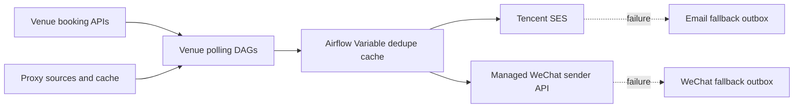
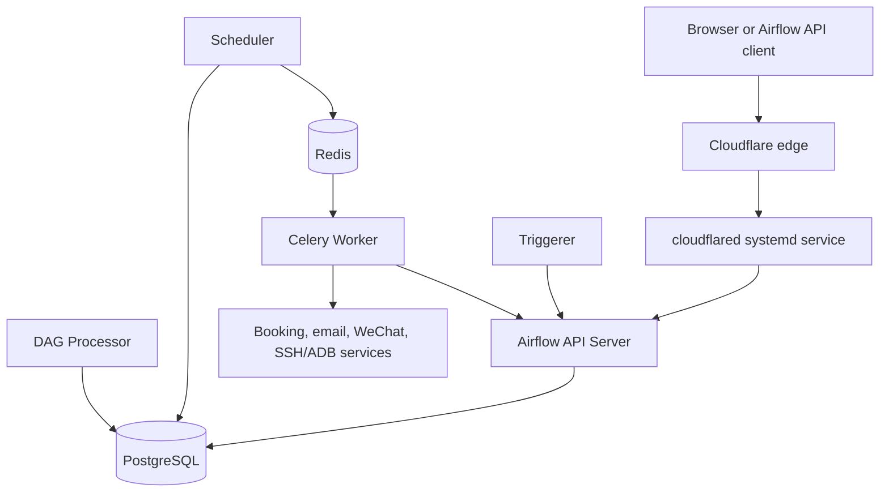

# Architecture

## Production Data Flow

The deduplication cache is written before delivery. Email and WeChat are
independent best-effort channels so a WeChat device outage does not delay email.
Fallback outboxes are deduplicated incident records, not automatic retry queues;
blind replay could send stale or duplicate availability.

The WeChat sender runs on the Android device host as an independent systemd
service with one process per device. It is not an Airflow component, but it is
repository-managed and included in production health checks. The health check
derives `/readyz` from the configured Airflow endpoint without printing the
endpoint value.

## Airflow 3 Runtime

The target runtime uses the official Airflow 3 image, a pinned custom build,
CeleryExecutor, PostgreSQL, Redis, and FAB Auth Manager. Production DAG source
is copied into that immutable image with normalized read permissions; services
do not depend on a mutable host DAG mount.

Workers reach the private Execution API through the explicit
`AIRFLOW_EXECUTION_API_SERVER_URL` setting. Its path must include the public
`AIRFLOW_BASE_URL` path prefix before `/execution/`.

Public access uses Cloudflare Tunnel at
`https://airflow.claude89757.cc`. `cloudflared.service` initiates the
outbound tunnel from the Airflow host to the Cloudflare edge and forwards to
`http://127.0.0.1:8080`. The API server accepts proxy headers, while the host
port is bound to loopback so the origin is not also exposed directly.

Airflow 3 uses fresh, explicitly named PostgreSQL, Redis, and log volumes. The Airflow 2
metadata database is not upgraded or reused; it remains intact for rollback.
Only contract-declared configuration and continuity state are imported.
Historical runs, task instances, XCom rows, and fallback outboxes do not cross
the cutover boundary.

## Ownership Boundaries

- DAG files define schedules and task wiring only. The component manifest
  enforces a 120-line limit and rejects direct network-client imports.
- Venue querying, parsing, filtering, and notification orchestration live in
  `src/wechat_airflow/venues/`.
- Proxy refresh implementations live in `src/wechat_airflow/proxy_tools/`.
- Device maintenance implementations live in
  `src/wechat_airflow/maintenance/`.
- Notification clients and fallback logic belong in `src/`.
- Airflow Variables provide runtime configuration, not business logic.
- Fresh-start Variable behavior is declared in
  `config/config-contracts.yaml`; venue deduplication state is preserved and
  fallback outboxes are reset without replay.
- Production maintenance is executed through scripts and one-off deployment
  manager commands, not through Airflow internal Python APIs.
- Metadata cleanup is deliberately outside the DagBag and Task SDK boundary.
  Its command is read-only by default and requires human-approved date
  confirmation before deleting records.

The authoritative active component and configuration contract is
`config/active-components.yaml`. Static verification checks each declared
schedule, and Airflow 3 DagBag verification checks the DAG ID, source file, and
task IDs against that manifest.

The venue and proxy adapters were moved without rewriting their dynamic API
payload handling. Their exact modules are a bounded typing backlog in
`pyproject.toml`; all other source modules remain under strict mypy checking.
