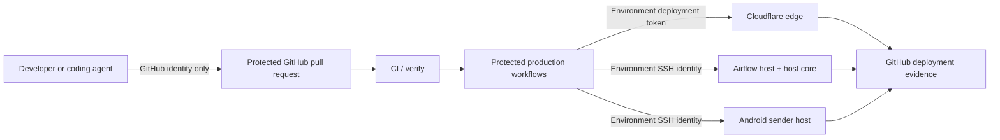
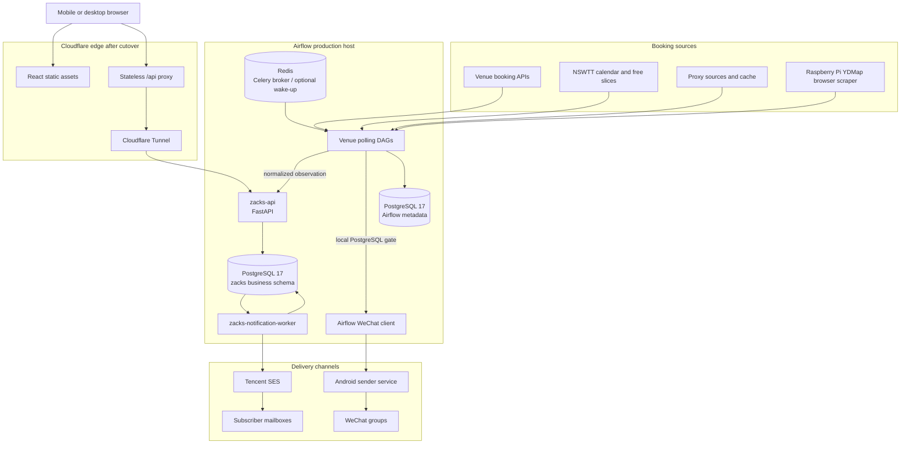
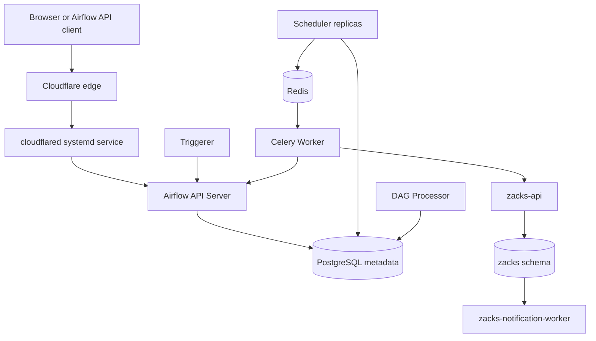

# Architecture

## Delivery Control Plane


```mermaid
flowchart LR
    Dev["Developer or coding agent"] -->|"GitHub identity only"| PR["Protected GitHub pull request"]
    PR --> CI["CI / verify"]
    CI --> Release["Protected production workflows"]
    Release -->|"Environment deployment token"| Edge["Cloudflare edge"]
    Release -->|"Environment SSH identity"| Host["Airflow host + host core"]
    Release -->|"Environment SSH identity"| Sender["Android sender host"]
    Edge --> Evidence["GitHub deployment evidence"]
    Host --> Evidence
    Sender --> Evidence
```

GitHub is the only development-to-production control plane. A developer
workstation may authenticate to GitHub but does not hold Cloudflare, SSH,
Airflow, database, email, or device credentials. `CI / verify` is authoritative
for an exact commit. The protected `production` Environment releases scoped
deployment identities only to approved workflows.

The initial host-core cutover uses `production-host-core.yml`, not the ordinary
component release path. It installs the exact commit in shadow mode, transfers
existing Tencent SES settings directly from Worker Secrets to root-owned host
files through an ephemeral encrypted envelope, imports D1 state twice around a
short write-quiescence window, switches one delivery owner, and verifies both
local and public endpoints. Any failure before final acceptance restores the
legacy owner and edge configuration. D1 records are retained for rollback and
are not deleted by the cutover.

## Production Data Flow


```mermaid
flowchart TB
    subgraph Sources["Booking sources"]
        APIs["Venue booking APIs"]
        NSWTT["NSWTT calendar and free slices"]
        Proxy["Proxy sources and cache"]
        Pi["Raspberry Pi YDMap browser scraper"]
    end

    subgraph AirflowHost["Airflow production host"]
        DAG["Venue polling DAGs"]
        CoreAPI["zacks-api<br/>FastAPI"]
        CoreWorker["zacks-notification-worker"]
        MetaDB[("PostgreSQL 17<br/>Airflow metadata")]
        AppDB[("PostgreSQL 17<br/>zacks business schema")]
        Redis[("Redis<br/>Celery broker / optional wake-up")]
        WeChatClient["Airflow WeChat client"]
    end

    subgraph Edge["Cloudflare edge after cutover"]
        Assets["React static assets"]
        ProxyAPI["Stateless /api proxy"]
        Tunnel["Cloudflare Tunnel"]
    end

    subgraph Channels["Delivery channels"]
        SES["Tencent SES"]
        Android["Android sender service"]
        Mailbox["Subscriber mailboxes"]
        Chat["WeChat groups"]
    end

    APIs --> DAG
    NSWTT --> DAG
    Proxy --> DAG
    Pi --> DAG

    DAG -->|"normalized observation"| CoreAPI
    CoreAPI --> AppDB
    AppDB --> CoreWorker
    CoreWorker --> SES
    SES --> Mailbox
    CoreWorker --> AppDB

    DAG -->|"local PostgreSQL gate"| WeChatClient
    WeChatClient --> Android
    Android --> Chat

    DAG --> MetaDB
    Redis --> DAG

    Browser["Mobile or desktop browser"] --> Assets
    Browser --> ProxyAPI
    ProxyAPI --> Tunnel
    Tunnel --> CoreAPI
```

### Durable ownership

PostgreSQL schema `zacks` is the sole durable business store after cutover. It
owns:

- email identities, verification challenges, browser receipts, profiles, roles,
  tiers, and invitation lifecycle;
- subscriptions and normalized subscription-to-venue relations;
- venue health, observation snapshots, availability event identities, and
  subscription-event deduplication;
- subscriber and system email Outboxes, leases, attempts, daily quotas, and
  Tencent SES submission/delivery state;
- the venue-level active-subscription generation used by the local WeChat gate;
- migration checkpoints, delivery-owner state, and operational read models.

The Airflow metadata database and the `zacks` business schema share the existing
PostgreSQL 17 service but have separate ownership and migration boundaries.
Host-core schema management must never modify Airflow metadata tables, and
Airflow metadata cleanup must never target `zacks` business records.

Redis remains the Celery broker and may later be used for wake-up signals,
short-lived locks, or hot cache entries. It is not authoritative: deleting or
restarting Redis cannot delete subscriptions, lose durable Outbox work, change a
quota result, or cause a duplicate delivery.

### Observation and matching path

Every venue adapter continues at its existing business-approved schedule. It
normalizes a venue result and calls the local `zacks-api` through the Compose
network. The API writes the observation, venue status, and semantic fingerprint
in PostgreSQL before returning. Real availability, health, or error changes are
visible on the first matching poll.

The local service matches a slot against active subscriptions using normalized
`subscription_venues`, ISO weekday masks, the slot's Asia/Shanghai booking date,
and time overlap. A unique subscription/event/channel identity prevents
repeated notification creation. A newly created subscription increments the
relevant venue generation so existing open availability can be evaluated on the
next natural poll without periodic full-table rematching.

During migration only, the host API persists locally and forwards the same raw
observation to the legacy Worker. Cloudflare remains the sole email owner until
the final owner switch. Dual observation writes are therefore safe; dual email
ownership is forbidden.

### Subscriber email

The local notification worker leases due Outbox rows with PostgreSQL
`FOR UPDATE SKIP LOCKED`, groups compatible venue lines into a recipient digest,
checks tier and global daily limits, evaluates the weather policy, and calls
Tencent SES. Provider message IDs, request IDs, errors, retries, and terminal
status are written back to PostgreSQL.

Provider reconciliation uses a bounded backoff and retention window. Verification
and lifecycle email use their own durable Outbox category so a venue reminder
backlog cannot block account access. Venue DAGs never contain fixed recipient
lists or Tencent credentials and never call SES directly.

### WeChat

The actual WeChat channel remains independent of the email worker:

```text
Airflow venue task -> local subscription gate -> WeChat client
-> Android sender systemd service -> Appium -> WeChat group
```

The gate is a local PostgreSQL decision. Cloudflare or D1 outage is not
interpreted as “no active subscription.” Existing per-venue message deduplication
and booking mini-program cooldown rules remain in the Airflow/host boundary.
Failures are isolated per chat and recorded as bounded incident evidence; stale
messages are never blindly replayed.

The Android sender runs one process per device. It is repository-managed and
included in production health checks, but it is not an Airflow process and does
not share the email Outbox.

## Cloudflare Boundary

After cutover, Cloudflare has no durable business ownership. It provides:

- DNS, TLS, WAF, DDoS protection, and static-asset delivery for
  `zacks.claude89757.cc`;
- a stateless `/api/*` reverse proxy to
  `https://airflow.claude89757.cc/zacks-api/api/*`;
- the existing outbound Cloudflare Tunnel from the Airflow host;
- exact deployment identity and security headers at the edge.

The Worker does not query D1, match subscriptions, send or reconcile email,
compute a WeChat gate, or run notification Cron after cutover. D1 is retained
read-only for a documented rollback window. Migration and secret-envelope
endpoints are disabled immediately after the successful cutover.

The tunnel contains a specific path rule for `/zacks-api/*` pointing to the
loopback-bound local API on port 8090. The existing Airflow UI/API rule continues
to point to port 8080. A Cloudflare/Tunnel outage can prevent browsers from
loading the site or changing subscriptions, but it cannot stop venue polling,
matching of existing subscriptions, email delivery, email retries, or WeChat
sending on the host.

## Airflow 3 Runtime


```mermaid
flowchart TB
    User["Browser or Airflow API client"] --> Edge["Cloudflare edge"]
    Edge --> Tunnel["cloudflared systemd service"]
    Tunnel --> API["Airflow API Server"]
    API --> MetaDB[("PostgreSQL metadata")]
    Scheduler["Scheduler replicas"] --> MetaDB
    DagProcessor["DAG Processor"] --> MetaDB
    Triggerer["Triggerer"] --> API
    Scheduler --> Redis[("Redis")]
    Redis --> Celery["Celery Worker"]
    Celery --> API
    Celery --> CoreAPI["zacks-api"]
    CoreAPI --> AppDB[("zacks schema")]
    AppDB --> NotificationWorker["zacks-notification-worker"]
```

The target runtime uses the official Airflow 3.3.0 image, a pinned custom image,
CeleryExecutor, PostgreSQL 17, Redis, and FAB Auth Manager. Production DAG source
is copied into the immutable image with normalized read permissions; services
do not depend on a mutable host DAG mount.

`zacks-api`, `zacks-notification-worker`, and the one-shot secret synchronization
service use the same exact application image, Compose network, and root-owned
secret directory. The API is bound to host loopback only. Runtime health reports
the exact deployment commit and schema/owner state.

Workers reach the private Airflow Execution API through the explicit
`AIRFLOW_EXECUTION_API_SERVER_URL` setting. Public Airflow access continues over
Cloudflare Tunnel, and the API server accepts proxy headers while its host port
is bound to loopback.

## Failure Boundaries

| Failure | Existing email | Existing WeChat | Venue polling | Web changes |
| --- | --- | --- | --- | --- |
| Cloudflare Worker/D1 | continues | continues | continues | may be unavailable |
| Cloudflare Tunnel/DNS | continues | continues | continues | unavailable externally |
| `zacks-api` | queued/retried after recovery | venue tasks may defer local gate refresh | continues | unavailable |
| notification worker | durable Outbox waits | unaffected | continues | readable |
| Redis | PostgreSQL polling remains authoritative | unaffected | Celery may be affected as today | readable |
| Tencent SES | retries/reconciliation continue | unaffected | continues | readable |
| Android sender | unaffected | isolated failure record | continues | readable |
| PostgreSQL | stops safely | gate cannot be refreshed | Airflow metadata also affected | unavailable |

No channel failure is allowed to mutate another channel's successful state.

## Ownership Boundaries

- DAG files define schedules and task wiring only. The component manifest
  enforces a 120-line limit and rejects direct network-client imports.
- Venue querying, parsing, filtering, and observation orchestration live in
  `src/wechat_airflow/venues/`.
- Subscription, Web API, matching, email, migration, and durable notification
  code lives in `src/wechat_airflow/host_core/`.
- Airflow observation compatibility, WeChat clients, and WeChat incident logic
  live in `src/wechat_airflow/notifications/`.
- Raspberry Pi scrape-host services live in `pi_host/` and are not imported by
  Airflow workers.
- The React application and stateless Cloudflare edge live in `webapp/`.
- Airflow Variables provide runtime configuration and emergency switches, not
  growing Outboxes, subscriptions, or notification history.
- PostgreSQL migrations are additive, idempotent where required, rehearsed in
  isolation, and separate from Airflow metadata migrations.
- Production maintenance runs through structured scripts and protected GitHub
  workflows, not ad-hoc remote shell or Airflow internal Python APIs.
- GitHub is the production identity, approval, and audit control plane. Runtime
  secrets remain in Worker Secrets during migration, root-owned host files,
  Airflow configuration stores, or systemd credentials.
- Metadata cleanup, D1 deletion, rollback-window closure, database replacement,
  and secret rotation are separate high-risk operations requiring explicit
  approval.

The authoritative machine-readable contracts are
`config/active-components.yaml`, `config/runtime-target.yaml`, and
`config/host-core-contract.yaml`. Static verification checks schedule and
ownership invariants, and Airflow 3 DagBag verification checks DAG IDs, source
files, and task IDs against the active component manifest.
