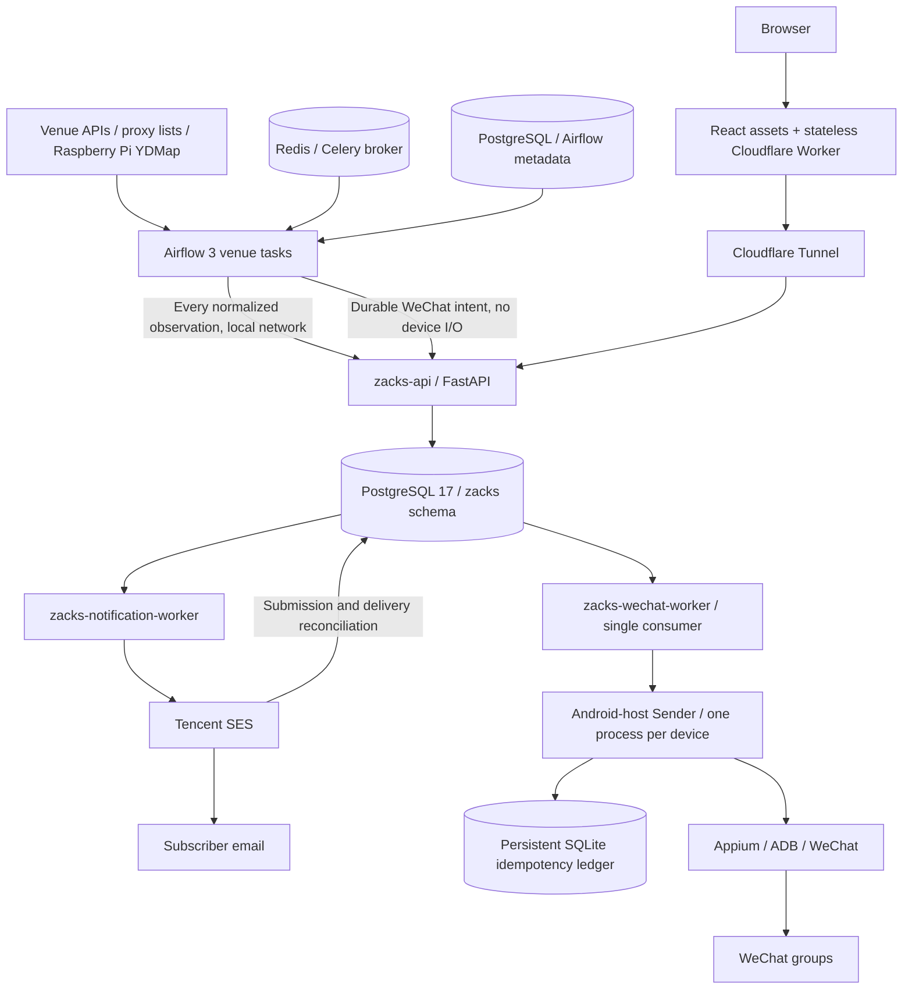

# Architecture: Host Core-only

Release implementation: 0.7.0 hardening, 2026-09-05. This describes the release
contract; only an accepted exact-commit production report establishes what is
live. See ADR 0013 and `docs/runbooks/host-core-cutover.md` for migration and
failure handling. No legacy runtime compatibility is supported.

## Delivery Control Plane

GitHub is the sole development-to-production control plane. Pull requests pass
`CI / verify`; protected production workflows receive scoped deployment
identities from the `production` Environment. Developers do not receive SSH,
Cloudflare, SES, device or database credentials. The Issue #39 owner-authorized
ship command installs one exact main commit and creates an immutable release
only after business acceptance. Temporary production schedulers are not used.

## Production Data Flow

```mermaid
flowchart TB
    Sources[Venue APIs / proxy lists / Raspberry Pi YDMap] --> DAG[Airflow 3 venue tasks]
    DAG -->|Every normalized observation, local network| API[zacks-api / FastAPI]
    DAG -->|Durable WeChat intent, no device I/O| API
    API --> PG[(PostgreSQL 17 / zacks schema)]
    PG --> Email[zacks-notification-worker]
    PG --> WeChat[zacks-wechat-worker / single consumer]
    Email --> SES[Tencent SES]
    SES --> Mail[Subscriber email]
    SES -->|Submission and delivery reconciliation| PG
    WeChat --> Sender[Android-host Sender / one process per device]
    Sender --> Ledger[(Persistent SQLite idempotency ledger)]
    Sender --> Appium[Appium / ADB / WeChat]
    Appium --> Groups[WeChat groups]
    Browser[Browser] --> Edge[React assets + stateless Cloudflare Worker]
    Edge --> Tunnel[Cloudflare Tunnel]
    Tunnel --> API
    Redis[(Redis / Celery broker)] --> DAG
    Meta[(PostgreSQL / Airflow metadata)] --> DAG
```

## Durable ownership and boundaries

PostgreSQL schema `zacks` is the only durable business store. It holds verified
identities/receipts, tiers/roles/invites, subscriptions, venue relationships,
observation fingerprints/current availability, semantic events, email intents,
leases/attempts/quotas, delivery status, WeChat intents, cooldowns and migration
checkpoints. `runtime_control` holds durable activation, a fenced delivery switch,
deployment identity and acceptance evidence. Airflow Variables retain configuration
and bounded collector preclaim caches, not the authoritative notification queue.

The `zacks` schema and Airflow metadata currently share PostgreSQL 17 and the
host. Business migrations never alter Airflow metadata. Metadata cleanup must
exclude `zacks`. Shared host/database failure remains a common failure boundary;
this is not multi-host high availability. Redis is the Celery broker only: loss
can stop new collection, but must not erase subscriptions or durable outboxes.

## Identity and subscriptions

The React contract uses email verification and bearer receipts. Challenge and
system-email intent are written together; wrong-code counts commit even when the
API returns an error. Verification attempts and send-code rates are bounded.
Per-user transaction locks serialize active-subscription limits. Expired
non-renewing subscriptions become inactive before duplicate enforcement.
Cancellation takes the delivery fence, records the inactive subscription and
cancels pending mail. A send that already started is allowed to finish before
cancellation returns. Coffee claims serialize by identity and preserve the
five-second delay and 30-day invitation validity.

## Observation, matching and deduplication

Every natural poll reaches the local API, including unchanged availability.
Scope-level PostgreSQL locks serialize observations; older observations cannot
resurrect newer closed slots. Current availability is refreshed atomically and
unhealthy/empty observations clear that scope. Semantic fingerprints suppress
redundant matching but not freshness updates. Subscription generations cause
newly created subscriptions to be matched on the next natural poll even when
availability has not changed. Event/subscription/channel uniqueness prevents
repeated queue creation. Venue IDs, DAG IDs, task IDs and approved schedules are
unchanged: Shenzhen Bay remains 15 seconds; explicit resource-safe exceptions
remain in the schedule policy.

## Email delivery

Subscriber and system-email outboxes are separate. Workers lease with
`FOR UPDATE SKIP LOCKED`, reserve user/global daily quota and write an immutable
attempt before external I/O. Subscriber groups use actual booking dates and
current tiers. Weather gating is per booking day, with explicit priority bypass
and bounded forecast caching. Before dispatch, cancellation, current availability,
slot start, tier eligibility and intent age are rechecked. Verification messages
expire with their challenge. Stale backlog is not blindly replayed.

Explicit pre-submission connection failures or provider rejection use bounded
retry. Ambiguous timeouts, process crashes or database failure after provider
acceptance become `submission_unknown`; retries cannot manufacture exactly-once
semantics across SES and PostgreSQL. Known provider IDs are reconciled with a
leased schedule and bounded backoff. `submitted` is not `delivered`; an expired
provider lookup window means unknown delivery, not proven failure.

## WeChat delivery

Venue tasks only persist intents through the local API. The dedicated host
consumer serializes work with a session advisory lock and stops if that lock
connection changes. It verifies active venue subscriptions, actual current slot
coverage, message validity and expiry before device dispatch. No stale remote
Cloudflare subscription gate participates. The Sender's readiness, exact commit
and durable ledger are checked before use. The ledger binds each idempotency key
to a payload hash and stores sent/uncertain outcomes across restarts. Known busy
conditions retry; unknown UI outcomes are quarantined, not replayed. PostgreSQL
owns per-group mini-program cooldowns and the host queue; the device ledger owns
the final device-side idempotency boundary.

## Cloudflare boundary

Cloudflare has no durable business ownership. The production Worker has no D1
binding, scheduled business work, migration endpoint or legacy backend import.
It serves React assets and proxies public APIs to the host through Tunnel, with
trusted-header sanitization and bounded timeouts. Public `/api/internal/*` routes
are not exposed. There is no automatic D1 fallback. An origin outage produces
an explicit 503, not stale success. D1 is retained unbound as a migration archive.
The one-time maintenance artifact exists only to freeze old writes and transfer
secrets before first activation; it never serves as a compatibility backend.

A Cloudflare/Tunnel outage can still prevent site access and subscription changes.
Existing durable mail and host-side matching do not use that edge. The acceptance
report additionally checks the actual Sender transport for Cloudflare proxying
before claiming that the complete WeChat path bypasses Cloudflare.

## Failure isolation and acceptance

Readiness checks dependency availability with meaningful HTTP status. Worker
health checks actual recent loop heartbeats, not merely a database connection.
Email and WeChat channel failures do not overwrite each other's outcome. A
PostgreSQL exclusive fence pauses delivery after in-flight calls finish. After
activation, deployments roll forward; old D1 snapshots cannot be reimported.
Backups and source exports remain root-only, never public workflow artifacts.

Acceptance has four distinct evidence classes:

1. Exact release identities and public HTTP health/bootstrap/security checks.
2. Production database/API logic through an operator-only transaction probe; all
   test writes are rolled back and it sends no real email/WeChat. It is not a
   public browser or external verification-email test.
3. All 26 venue DAGs passing three natural cycles, fresh per-scope observations,
   healthy auxiliary tasks and advancing consumers/queues.
4. Real natural SES-delivered and WeChat-sent records after the release window.

Missing evidence is not a passing check. Only privacy-safe counts, venue/task
status, identity hashes and component commits appear in reports. Testing and
ordinary health checks never generate synthetic real notifications.

The machine-readable authorities are `active-components.yaml`,
`venue-schedule-policy.yaml`, `runtime-target.yaml` and `host-core-contract.yaml`.
