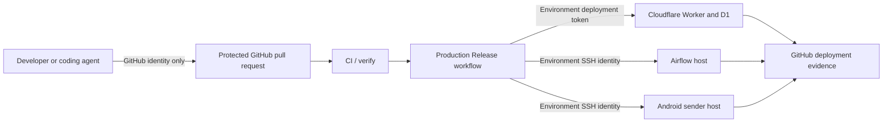
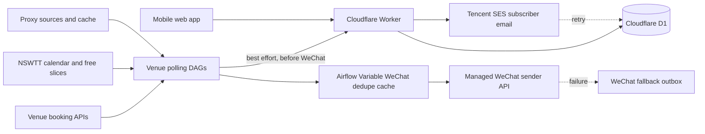
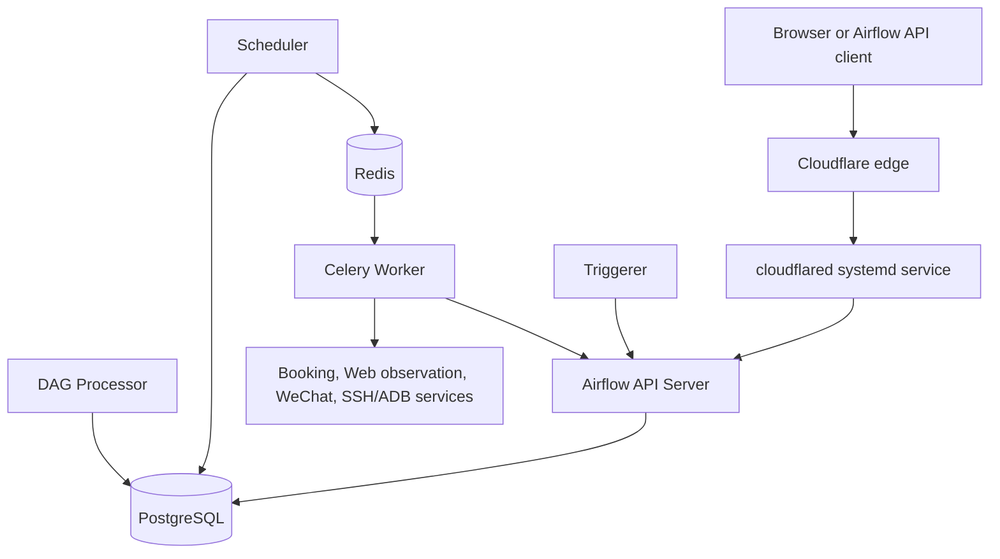

# Architecture

## Delivery Control Plane

```mermaid
flowchart LR
    Dev["Developer or coding agent"] -->|"GitHub identity only"| PR["Protected GitHub pull request"]
    PR --> CI["CI / verify"]
    CI --> Release["Production Release workflow"]
    Release -->|"Environment deployment token"| CF["Cloudflare Worker and D1"]
    Release -->|"Environment SSH identity"| Airflow["Airflow host"]
    Release -->|"Environment SSH identity"| Sender["Android sender host"]
    CF --> Evidence["GitHub deployment evidence"]
    Airflow --> Evidence
    Sender --> Evidence
```

GitHub is the only development-to-production control plane. A developer
workstation may authenticate to GitHub but does not hold Cloudflare, SSH,
Airflow, database, email, or device credentials. `CI / verify` is authoritative
for an exact commit. The protected `production` Environment releases scoped
deployment identities only to approved workflows. Component runtime secrets
remain in Airflow Variables, Cloudflare Worker Secrets, root-owned host Secret
files, and systemd credentials; they are never downloaded through GitHub.

Cloudflare, Airflow, and sender health checks compare the deployed identity with
the workflow's explicit full target SHA, never with a workstation checkout.
Application rollback uses a previously verified release SHA. Database restore
and metadata deletion remain separate high-risk operations.

## Production Data Flow

```mermaid
flowchart LR
    API["Venue booking APIs"] --> DAG["Venue polling DAGs"]
    NSWTT["NSWTT calendar and free slices"] --> DAG
    Proxy["Proxy sources and cache"] --> DAG
    DAG -->|"best effort, before WeChat"| Worker["Cloudflare Worker"]
    DAG --> Cache["Airflow Variable WeChat dedupe cache"]
    Cache --> WeChat["Managed WeChat sender API"]
    Web["Mobile web app"] --> Worker
    Worker --> D1[("Cloudflare D1")]
    Worker --> SubscriberEmail["Tencent SES subscriber email"]
    SubscriberEmail -. retry .-> D1
    WeChat -. failure .-> WeChatOutbox["WeChat fallback outbox"]
```

Venue adapters publish raw available slots before attempting WeChat delivery,
so a device outage cannot delay subscriber email. Publishing is best effort
and cannot fail a DAG. Airflow has no fixed recipient lists and does not send
venue email directly. The Worker stores verified-email receipts, subscriptions,
observed slot event keys, and a retrying email outbox in D1. A
`(subscription_id, event_key)` uniqueness contract prevents duplicate
subscriber notifications. User-selected time windows are independent of the
legacy weekday/weekend filters retained only for WeChat.

The Dashah River adapter is calendar-gated because free courts are not released
for every date. It publishes only zero-price availability from dates that are
both on sale and backed by a non-empty free-court list. The Web application
therefore never infers a free release from an ordinary empty calendar date.
Best-effort WeChat for this venue goes only to `Zacks_大沙河限定免费`.

TOPS, 泛思博特福中福, and PICKLE POP宝安 share the public PosPal appointment
API. Each adapter carries its own store ID and project UID. PICKLE POP宝安
publishes tennis courts only and never treats pickleball rooms as tennis
availability. WeChat for these paid venues uses the shared
`SZ_TENNIS_CHATROOMS` list.

Dashah International Tennis Center is a paid YDMap H5 venue. Airflow does not
open the booking page itself. A Raspberry Pi scrape host runs Chromium on a
private loopback HTTP service; the venue watcher SSHes to that host, curls
`http://127.0.0.1:8788/inspect?days=5`, publishes the raw slots to the Web app,
then sends best-effort WeChat to the shared `SZ_TENNIS_CHATROOMS` list. The
scrape HTTP port is not public. Runtime SSH settings live in the Airflow
Variable `PI_DEVICE_SSH`; GitHub `PI_DEVICE_SSH_*` secrets are only the
protected seed for that Variable.

Greater Bay Area WeChat uses the same Zacks chatrooms as Shenzhen Bay, with a
different hour window: weekdays 18:00-21:00 and weekends 12:00-21:00. The booking
query ends at 21:00 so a closed 21:00-22:00 hour cannot appear as a free slot.
Shenzhen Bay WeChat remains weekdays 18:00-22:00 and weekends 16:00-22:00.
Shenzhen Sports Center WeChat uses weekdays 18:00-21:00 and weekends 17:00-21:00.

WeChat availability alerts append the venue booking mini-program as the last
line of the same send, at most once per chat and mini-program every two hours.
Shenzhen Bay and Greater Bay Area share the 未来荟 program, so the second venue
does not repeat that card. Slot dedupe caches stay link-free.

The Airflow WeChat deduplication cache is written before WeChat delivery.
Its fallback outbox is a deduplicated incident record, not an automatic retry
queue; blind replay could send stale or duplicate messages.

The public web app never displays current availability and cannot book courts.
It displays only aggregate subscription counts, notification counts, and
inspection health. Email addresses are returned only as masked values after a
valid 180-day browser receipt is presented.

The WeChat sender runs on the Android device host as an independent systemd
service with one process per device. It is not an Airflow component, but it is
repository-managed and included in production health checks. The health check
derives `/readyz` from the configured Airflow endpoint without printing the
endpoint value.

## Airflow 3 Runtime

```mermaid
flowchart TB
    User["Browser or Airflow API client"] --> Edge["Cloudflare edge"]
    Edge --> Tunnel["cloudflared systemd service"]
    Tunnel --> API
    API["Airflow API Server"] --> DB[("PostgreSQL")]
    Scheduler["Scheduler"] --> DB
    DagProcessor["DAG Processor"] --> DB
    Triggerer["Triggerer"] --> API
    Scheduler --> Redis[("Redis")]
    Redis --> Worker["Celery Worker"]
    Worker --> API
    Worker --> External["Booking, Web observation, WeChat, SSH/ADB services"]
```

The target runtime uses the official Airflow 3 image, a pinned custom build,
CeleryExecutor, PostgreSQL, Redis, and FAB Auth Manager. Production DAG source
is copied into that immutable image with normalized read permissions; services
do not depend on a mutable host DAG mount.

Workers reach the private Execution API through the explicit
`AIRFLOW_EXECUTION_API_SERVER_URL` setting. Its path must include the public
`AIRFLOW_BASE_URL` path prefix before `/execution/`.

Public access uses Cloudflare Tunnel at
`https://airflow.claude89757.cc`. `cloudflared.service` initiates the
outbound tunnel from the Airflow host to the Cloudflare edge and forwards to
`http://127.0.0.1:8080`. The API server accepts proxy headers, while the host
port is bound to loopback so the origin is not also exposed directly.

Airflow 3 uses fresh, explicitly named PostgreSQL, Redis, and log volumes. The Airflow 2
metadata database is not upgraded or reused; it remains intact for rollback.
Only contract-declared configuration and continuity state are imported.
Historical runs, task instances, XCom rows, and fallback outboxes do not cross
the cutover boundary.

## Ownership Boundaries

- DAG files define schedules and task wiring only. The component manifest
  enforces a 120-line limit and rejects direct network-client imports.
- Venue querying, parsing, filtering, and notification orchestration live in
  `src/wechat_airflow/venues/`.
- Raspberry Pi scrape-host services live in `pi_host/` and are not imported by
  Airflow workers.
- Proxy refresh implementations live in `src/wechat_airflow/proxy_tools/`.
- Device maintenance implementations live in
  `src/wechat_airflow/maintenance/`.
- Airflow observation, WeChat clients, and WeChat fallback logic belong in
  `src/`.
- Web UI, subscription matching, email verification, and subscriber delivery
  belong in `webapp/`; Airflow owns only venue observation publication.
- Airflow Variables provide runtime configuration, not business logic.
- Fresh-start Variable behavior is declared in
  `config/config-contracts.yaml`; venue WeChat deduplication state is preserved
  and the WeChat fallback outbox is reset without replay.
- Production maintenance is executed through scripts and one-off deployment
  manager commands, not through Airflow internal Python APIs.
- GitHub is the production identity, approval, and audit control plane. Its
protected workflows hold only scoped deployment identities; Airflow,
Cloudflare, and the Android sender retain their own runtime secrets. The
Raspberry Pi scrape-host login is stored as `PI_DEVICE_SSH_*` names in the
GitHub `production` Environment and must not be copied onto developer
machines.
- Airflow infrastructure credentials are mounted per service from the
  root-owned, root-group-readable host Secret directory. Airflow and
  PostgreSQL remain non-root processes in group `0`; the sender reads systemd
  credentials.
  Developer machines generate isolated test credentials and never receive
  production values.
- Metadata cleanup is deliberately outside the DagBag and Task SDK boundary.
  Its command is read-only by default and requires human-approved date
  confirmation before deleting records.

The authoritative active component and configuration contract is
`config/active-components.yaml`. Static verification checks each declared
schedule, and Airflow 3 DagBag verification checks the DAG ID, source file, and
task IDs against that manifest.

The venue and proxy adapters were moved without rewriting their dynamic API
payload handling. Their exact modules are a bounded typing backlog in
`pyproject.toml`; all other source modules remain under strict mypy checking.
