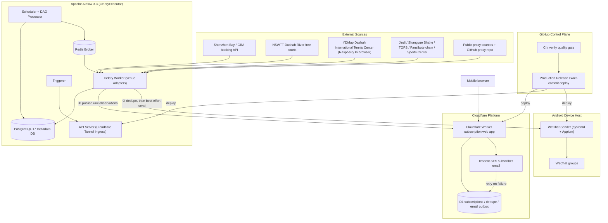

# 🎾 WeChat-on-Airflow

> Shenzhen tennis court availability alerting platform: Apache Airflow 3 workflows monitor bookable slots across Shenzhen tennis venues, push free slots to email subscribers, and send best-effort WeChat group notifications.

[English](./README.en.md) · [中文](./README.md)

[](https://github.com/claude89757/wechat-on-airflow/actions/workflows/ci.yml)
[](https://www.python.org/)
[](https://airflow.apache.org/)
[](https://workers.cloudflare.com/)
[](LICENSE)

## ✨ Features

- **Multi-venue polling**: 14 Shenzhen venue DAGs (Shenzhen Bay at 15s intervals, Greater Bay Area, Dashah River free courts, Dashah International Tennis Center, Jindi, Shangyue Shahe, TOPS, Fansibote Fuzhongfu plus Shenyun/Shekou/Xinan/Zhengzhong/Antuoshan, Sports Center) + HTTPS proxy watchers + daily device maintenance
- **Email subscriptions**: a Cloudflare Worker web app owns email verification, subscription matching, event deduplication, and retries (delivered via Tencent SES)
- **WeChat alerts**: an independent sender on the Android device host (systemd + Appium) delivers best-effort messages; failures are isolated per chat and never block the email path
- **Configuration as contract**: machine-readable component/config/runtime contracts under `config/`; DAGs only wire schedules while business logic lives in `src/`
- **Exact-commit releases**: GitHub Actions is the only control plane; deploys are pinned to an exact commit followed by automated health checks
- **Quality gates**: `make verify` covers lint, type checking, unit tests, web build, image build, and DagBag contract checks

## 🏗️ Architecture



**Core data-flow principles:**

1. Airflow publishes raw venue observations to the web app **before** attempting WeChat delivery (publishing can never fail a DAG);
2. The web app is the **only email owner**: verification, subscription matching, deduplication, and retries all live in its D1 outbox;
3. WeChat delivery is best-effort: dedupe cache is written first, failures are isolated per chat into a fallback outbox that is **never replayed automatically**.

See [ARCHITECTURE.md](./ARCHITECTURE.md) for details.

## 🧱 Tech Stack

| Component | Role |
| --- | --- |
| Apache Airflow 3.3.0 (CeleryExecutor) | Scheduling and orchestration |
| Python 3.12 | Runtime language |
| PostgreSQL 17 | Airflow metadata database |
| Redis | Celery broker |
| Cloudflare Workers + D1 | Subscription web app, dedupe, email outbox |
| Tencent SES | Subscriber email delivery |
| Android + Appium (systemd) | WeChat message sender |
| Cloudflare Tunnel | Public ingress to Airflow |

Public endpoints: Airflow console `https://airflow.claude89757.cc` · subscription site `https://zacks.claude89757.cc`

## 📁 Repository Layout

```
├── dags/                       # Production DAGs (wiring only, <120 lines each)
│   └── tennis_dags/
│       ├── sz_tennis/          # Shenzhen venue watchers (Shenzhen Bay / GBA / Dashah River free courts / Dashah International Tennis Center / Jindi / Shangyue Shahe / TOPS / Fansibote chain / Sports Center)
│       ├── proxy_tools/        # HTTPS proxy watchers (every 5 minutes)
│       └── zacks_phone_reboot_dag.py  # Device maintenance every two days
├── pi_host/                    # Raspberry Pi scrape host (YDMap browser inspection)
├── src/wechat_airflow/         # Business implementation package
│   ├── venues/                 # Venue API adapters, parsing, filtering
│   ├── notifications/          # Web observation publishing + WeChat delivery
│   ├── proxy_tools/            # Proxy list refresh
│   └── maintenance/            # Android device maintenance
├── webapp/                     # Cloudflare Worker + React subscription app (sole email owner)
├── config/                     # Machine-readable contracts: components / config / runtime target
├── scripts/                    # Idempotent dev and ops commands
├── docker/                     # Reproducible Airflow image definition
├── docs/                       # Architecture, runbooks, ADRs, release strategy
└── tests/                      # Unit / contract / DAG import / smoke tests
```

## 🚀 Quick Start

Requires Python 3.12 and Docker Compose v2:

```bash
make setup            # create venv, install Python and webapp dependencies
make local-secrets    # generate dev-only Docker Secrets (local environments)
make verify           # quality gate: lint + typecheck + unit tests + builds + DagBag contract check
```

> Tests and smoke checks **never** send real email or WeChat messages.

## 📖 Documentation

| Doc | Description |
| --- | --- |
| [ARCHITECTURE.md](./ARCHITECTURE.md) | System architecture and ownership boundaries |
| [AGENTS.md](./AGENTS.md) | Repository overview and operations guide (read first) |
| [docs/runbooks/](./docs/runbooks/) | Production runbooks: deploy / rollback / troubleshooting / upgrade |
| [config/](./config/) | Component, configuration, and runtime contracts |
| [CONTRIBUTING.md](./CONTRIBUTING.md) | Contribution guidelines |
| [SECURITY.md](./SECURITY.md) | Security policy |

## 🗄️ Configuration

Production settings live in the protected GitHub Environment, Airflow Variables, Cloudflare Worker Secrets, and host Docker Secrets. Airflow Variable names and schemas are documented in `config/active-components.yaml` and `config/config-contracts.yaml` (neither contains real values).

Airflow holds no fixed recipient lists and does not send venue email directly.

## 🤝 Contributing

See [CONTRIBUTING.md](./CONTRIBUTING.md), [SECURITY.md](./SECURITY.md), and [CODE_OF_CONDUCT.md](./CODE_OF_CONDUCT.md). Release strategy, support matrix, and rollback expectations are in [docs/release-strategy.md](./docs/release-strategy.md).

## 📄 License

Apache License 2.0. See [LICENSE](./LICENSE).
