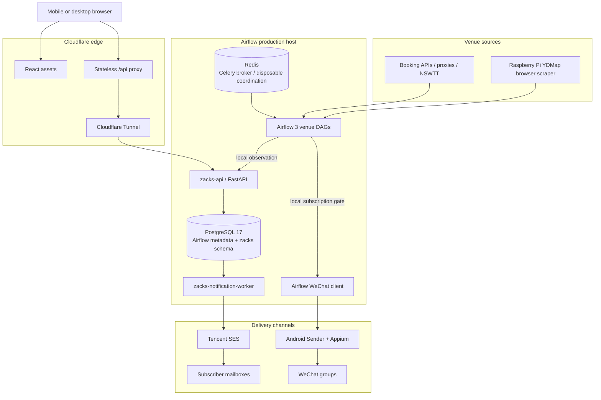

> **Host Core-only hardening (2026-09-05):** the old compatibility/rollback
> description below is superseded by [Architecture](ARCHITECTURE.md) and
> [ADR 0013](docs/adr/0013-host-core-only-reliable-delivery.md). Production uses
> PostgreSQL-owned email and a dedicated WeChat worker with durable device
> idempotency. D1 is an unbound archive, never a runtime fallback. Only an
> exact-commit production acceptance report establishes deployment completion.

# 🎾 WeChat-on-Airflow

> Shenzhen tennis availability alerts: Apache Airflow 3 performs high-frequency venue polling, a PostgreSQL-backed notification core on the Airflow host owns subscriptions and email, and Cloudflare is reduced to the public edge.

[English](./README.en.md) · [中文](./README.md)

[](https://github.com/claude89757/wechat-on-airflow/actions/workflows/ci.yml)
[](https://www.python.org/)
[](https://airflow.apache.org/)
[](https://www.postgresql.org/)
[](LICENSE)

## ✨ Features

- **Multi-venue polling**: 26 Shenzhen venue DAGs. Shenzhen Bay keeps its approved 15-second exception; other venues use the one-minute default or an explicit resource-safe cadence.
- **Host-owned subscription core**: local `zacks-api` accepts observations and Web requests; PostgreSQL schema `zacks` stores identities, subscriptions, dedupe state, Outboxes, quotas, and delivery results.
- **Subscriber email**: `zacks-notification-worker` performs matching, digesting, tier limits, weather policy, Tencent SES submission, retries, and delivery reconciliation.
- **WeChat alerts**: Airflow continues to call the Android-hosted WeChat Sender directly. The venue gate is read from local PostgreSQL rather than Cloudflare D1.
- **Stateless Cloudflare edge**: the Worker serves React assets and proxies `/api/*`; D1 is retained read-only only for the rollback window.
- **Failure isolation**: Cloudflare/D1 failure does not stop existing email or WeChat delivery, and Redis loss cannot lose or duplicate durable notification work.
- **Exact-commit releases**: GitHub Actions is the only production control plane and verifies the deployed SHA across all affected runtimes.
- **Complete quality gate**: `make verify` covers Ruff, mypy, Python tests, Web/Worker tests, browser regression, Compose, images, and Airflow DagBag contracts.

## 🏗️ Architecture



### Core principles

1. **PostgreSQL is the only durable business source of truth.** It owns users, subscriptions, venue status, event identities, notification Outboxes, daily limits, and provider status.
2. **Redis is not authoritative.** It remains the Celery broker and may provide wake-ups or hot cache entries, but notification correctness never depends on Redis persistence.
3. **Exactly one email owner is active.** Cloudflare remains the legacy owner during migration; the host worker becomes the sole owner only after the atomic cutover.
4. **WeChat no longer depends on Cloudflare.** Airflow obtains the venue eligibility decision from local PostgreSQL before calling the Android sender.
5. **Cloudflare is an edge boundary only.** It provides static assets, TLS/WAF, stateless API forwarding, and Tunnel ingress—no D1 query, notification Cron, matching, or email delivery after cutover.
6. **The migration is reversible.** Shadow services, encrypted secret transfer, initial import, natural dual-write observations, quiescence, final delta import, and automatic rollback are required. D1 is not deleted.

See [ARCHITECTURE.md](./ARCHITECTURE.md), [ADR 0012](./docs/adr/0012-airflow-host-notification-core.md), and the [cutover runbook](./docs/runbooks/host-core-cutover.md).

## 🧱 Tech Stack

| Component | Role |
| --- | --- |
| Apache Airflow 3.3.0 (CeleryExecutor) | Venue polling, scheduling, and orchestration |
| Python 3.12 | Venue adapters, API, migration, and notification worker |
| PostgreSQL 17 | Airflow metadata plus the isolated `zacks` business schema |
| Redis | Celery broker and optional disposable coordination |
| FastAPI + Uvicorn | Local subscription and observation API |
| Tencent SES | Verification, lifecycle, and subscriber email |
| Android + Appium (systemd) | WeChat group sender |
| React + Cloudflare Worker | Static Web application and stateless edge proxy |
| Cloudflare Tunnel | Secure public ingress for Airflow and `zacks-api` |

Public endpoints: Airflow console `https://airflow.claude89757.cc` · subscription site `https://zacks.claude89757.cc`

## 📁 Repository Layout

```text
├── dags/                              # Production DAG wiring only
├── pi_host/                           # Raspberry Pi YDMap browser scraper
├── src/wechat_airflow/
│   ├── venues/                        # Venue APIs, parsing, filtering
│   ├── host_core/                     # PostgreSQL API, matching, migration, email worker
│   ├── notifications/                 # Observation compatibility and WeChat clients
│   ├── proxy_tools/                   # Proxy refresh
│   └── maintenance/                   # Android maintenance
├── webapp/
│   ├── src/                           # React client
│   └── cloudflare/                    # Stateless edge and migration compatibility
├── config/
│   ├── active-components.yaml
│   ├── runtime-target.yaml
│   └── host-core-contract.yaml
├── scripts/                           # Idempotent development and production operations
├── docker/                            # Reproducible runtime images
├── docs/                              # ADRs, runbooks, architecture, evidence
└── tests/                             # Unit, contract, migration, browser, DagBag tests
```

## 🚀 Quick Start

Requires Python 3.12, Node 24, and Docker Compose v2:

```bash
make setup
make local-secrets
make verify
```

Tests, CI, and normal health checks **never** send real email or WeChat messages.

The local Compose runtime includes PostgreSQL, Redis, all Airflow services,
`zacks-api`, and `zacks-notification-worker`. The initial production transition
must use the protected `Production Host Core` workflow; it must not be replaced
with an ordinary Web deployment.

## 📖 Documentation

| Document | Purpose |
| --- | --- |
| [ARCHITECTURE.md](./ARCHITECTURE.md) | Current architecture and failure boundaries |
| [AGENTS.md](./AGENTS.md) | Repository operating and safety invariants |
| [config/host-core-contract.yaml](./config/host-core-contract.yaml) | Machine-readable host-core ownership contract |
| [docs/adr/0012-airflow-host-notification-core.md](./docs/adr/0012-airflow-host-notification-core.md) | Architecture decision and migration principles |
| [docs/runbooks/host-core-cutover.md](./docs/runbooks/host-core-cutover.md) | Shadow migration, cutover, verification, rollback |
| [docs/release-strategy.md](./docs/release-strategy.md) | Exact-commit release strategy |
| [SECURITY.md](./SECURITY.md) | Security policy |

## 🔐 Configuration and Security

- The protected GitHub Environment stores deployment identities, not business state.
- Airflow Variables store venue configuration and emergency switches, not growing business history.
- PostgreSQL schema `zacks` stores all durable application state.
- Tencent SES credentials live in root-owned host Secret files. During migration they are transferred directly through an ephemeral RSA-OAEP/AES-GCM envelope; GitHub never receives plaintext.
- D1 deletion, business-data cleanup, secret rotation, and database replacement are separately approved high-risk operations.

## 🤝 Contributing

See [CONTRIBUTING.md](./CONTRIBUTING.md), [SECURITY.md](./SECURITY.md), and [CODE_OF_CONDUCT.md](./CODE_OF_CONDUCT.md).

## 📄 License

Apache License 2.0. See [LICENSE](./LICENSE).
