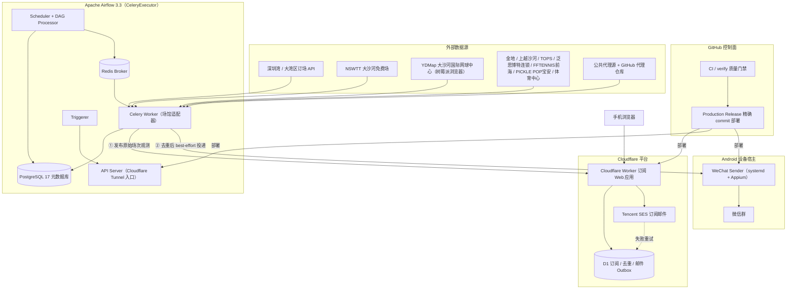

# 🎾 WeChat-on-Airflow

> 深圳网球场地空场提醒平台：基于 Apache Airflow 3 自动巡检多个深圳网球场的可订状态，向邮箱订阅用户推送空闲场次，并同步发送 best-effort 的微信群提醒。

[中文](./README.md) · [English](./README.en.md)

[](https://github.com/claude89757/wechat-on-airflow/actions/workflows/ci.yml)
[](https://www.python.org/)
[](https://airflow.apache.org/)
[](https://workers.cloudflare.com/)
[](LICENSE)

## ✨ 功能特性

- **多场馆自动巡检**：26 个深圳场馆巡检 DAG（深圳湾 15s 高频、大湾区、大沙河免费场、大沙河国际网球中心、金地、上越沙河、TOPS、泛思博特福中福、深云、蛇口、新安、正中、安托山、棕榈泉、观湖、坂田、沙河、保税、南油、新桥、壹方城、麒麟、茅洲河、FFTENNIS前海国际网球中心、PICKLE POP宝安、体育中心）+ HTTPS 代理巡检 + 每日设备维护
- **邮箱订阅推送**：Cloudflare Worker Web 应用全权负责邮箱验证、订阅匹配、事件去重与失败重试（Tencent SES 投递）
- **微信群提醒**：Android 设备宿主上的独立 WeChat Sender（systemd + Appium），best-effort 投递，失败按群隔离记录，不影响邮件链路
- **代码即契约**：`config/` 下的机器可读组件/配置/运行时契约；DAG 仅做调度编排，业务实现全部位于 `src/` 包
- **精确发布**：GitHub Actions 是唯一控制面，按精确 commit 部署，部署后自动健康校验
- **完整质量门禁**：`make verify` 覆盖 lint、类型检查、单元测试、Web 构建、镜像构建与 DagBag 契约检查

## 🏗️ 系统架构



**核心数据流原则：**

1. Airflow **先**向 Web 应用发布原始场次观测（发布失败不影响巡检 DAG），**再**尝试微信投递；
2. Web 应用是**唯一邮件投递方**：邮箱验证、订阅匹配、去重与重试全部由它负责（D1 Outbox）；
3. 微信投递为 best-effort：先去重缓存后投递，失败按群隔离记录到回退 Outbox，**绝不自动重放**。

更多细节见 [ARCHITECTURE.md](./ARCHITECTURE.md)。

## 🧱 技术栈

| 组件 | 用途 |
| --- | --- |
| Apache Airflow 3.3.0（CeleryExecutor） | 调度与任务编排 |
| Python 3.12 | 运行语言 |
| PostgreSQL 17 | Airflow 元数据库 |
| Redis | Celery broker |
| Cloudflare Workers + D1 | 订阅 Web 应用、去重与邮件 Outbox |
| Tencent SES | 订阅邮件投递 |
| Android + Appium（systemd） | 微信群消息发送端 |
| Cloudflare Tunnel | Airflow 公网入口 |

在线服务：Airflow 控制台 `https://airflow.claude89757.cc` · 订阅站点 `https://zacks.claude89757.cc`

## 📁 项目结构

```
├── dags/                       # 生产 DAG（仅调度编排，单文件 <120 行）
│   └── tennis_dags/
│       ├── sz_tennis/          # 深圳场馆巡检：深圳湾 / 大湾区 / 大沙河免费场 / 大沙河国际网球中心 / 金地 / 上越沙河 / TOPS / 泛思博特连锁 / FFTENNIS前海 / PICKLE POP宝安 / 体育中心
│       ├── proxy_tools/        # HTTPS 代理巡检（每 5 分钟）
│       └── zacks_phone_reboot_dag.py  # 每两天设备维护
├── pi_host/                    # 树莓派采集服务（YDMap 浏览器巡检）
├── src/wechat_airflow/         # 业务实现包
│   ├── venues/                 # 场馆 API 适配、解析与过滤
│   ├── notifications/          # Web 观测发布 + 微信投递
│   ├── proxy_tools/            # 代理列表刷新
│   └── maintenance/            # Android 设备维护
├── webapp/                     # Cloudflare Worker + React 订阅应用（唯一邮件投递方）
├── config/                     # 机器可读契约：组件 / 配置 / 运行时目标
├── scripts/                    # 幂等的开发与运维命令
├── docker/                     # 可复现的 Airflow 镜像定义
├── docs/                       # 架构、runbook、ADR、发布策略
└── tests/                      # 单元 / 契约 / DAG 导入 / 冒烟测试
```

## 🚀 快速开始

需要 Python 3.12 与 Docker Compose v2：

```bash
make setup            # 创建 venv、安装依赖与 webapp 依赖
make local-secrets    # 生成本地开发用 Docker Secret（仅开发环境）
make verify           # 本地质量门禁：lint + 类型检查 + 单测 + 构建 + DagBag 契约检查
```

> 测试与冒烟检查**绝不会**发送真实的邮件或微信消息。

## 📖 文档

| 文档 | 说明 |
| --- | --- |
| [ARCHITECTURE.md](./ARCHITECTURE.md) | 系统架构与所有权边界 |
| [AGENTS.md](./AGENTS.md) | 仓库总览与运维须知（建议先读） |
| [docs/runbooks/](./docs/runbooks/) | 生产 runbook：部署 / 回滚 / 排障 / 升级 |
| [config/](./config/) | 组件、配置与运行时契约 |
| [CONTRIBUTING.md](./CONTRIBUTING.md) | 贡献指南 |
| [SECURITY.md](./SECURITY.md) | 安全策略 |

## 🗄️ 配置

生产配置由受保护的 GitHub Environment、Airflow Variables、Cloudflare Worker Secrets 与主机 Docker Secrets 管理；Airflow Variable 名称与结构见 `config/active-components.yaml` 与 `config/config-contracts.yaml`（均不含真实值）。

Airflow 不持有固定收件人列表，也不直接发送场馆邮件。

## 🤝 贡献

见 [CONTRIBUTING.md](./CONTRIBUTING.md)、[SECURITY.md](./SECURITY.md) 与 [CODE_OF_CONDUCT.md](./CODE_OF_CONDUCT.md)。发布策略、支持矩阵与回滚预期见 [docs/release-strategy.md](./docs/release-strategy.md)。

## 📄 License

Apache License 2.0。见 [LICENSE](./LICENSE)。
