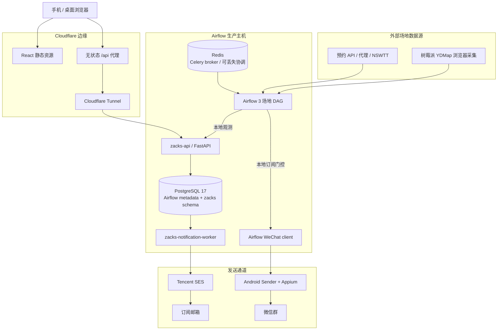

# 🎾 WeChat-on-Airflow

> 深圳网球场地空场提醒平台：Apache Airflow 3 负责高频场地巡检，Airflow 主机上的 PostgreSQL 通知核心负责订阅、邮件和微信门控，Cloudflare 只承担公网边缘入口。

[中文](./README.md) · [English](./README.en.md)

[](https://github.com/claude89757/wechat-on-airflow/actions/workflows/ci.yml)
[](https://www.python.org/)
[](https://airflow.apache.org/)
[](https://www.postgresql.org/)
[](LICENSE)

## ✨ 功能特性

- **多场馆自动巡检**：26 个深圳场馆巡检 DAG；深圳湾保持 15 秒低延迟例外，其余场馆按 1 分钟默认或显式资源安全周期运行。
- **主机侧订阅闭环**：本地 `zacks-api` 接收场地观测和 Web 请求；PostgreSQL `zacks` schema 保存用户、订阅、去重、Outbox、配额与投递状态。
- **邮箱订阅推送**：`zacks-notification-worker` 负责订阅匹配、摘要合并、天气策略、标准/优先额度、Tencent SES 发送、退避重试和送达对账。
- **微信群提醒**：Airflow 继续直接调用 Android 设备宿主上的 WeChat Sender；发送许可来自本地 PostgreSQL，不再依赖 Cloudflare D1。
- **Cloudflare 边缘化**：Cloudflare Worker 只提供 React 静态资源和无状态 `/api/*` 代理；D1 仅在迁移后保留为只读回滚副本。
- **故障隔离**：Cloudflare/D1 故障不停止已有订阅的邮件与微信；Redis 丢失不能丢失或重复通知；单个发送通道故障不污染另一通道。
- **精确发布**：GitHub Actions 是唯一生产控制面，所有组件按完整 commit SHA 发布和验收。
- **完整质量门禁**：`make verify` 覆盖 Ruff、mypy、Python 测试、Web/Worker 测试、浏览器回归、Compose、镜像和 Airflow DagBag 契约。

## 🏗️ 系统架构



### 核心原则

1. **PostgreSQL 是唯一业务事实源。** 用户、订阅、场地状态、事件去重、邮件 Outbox、每日额度和投递结果都写入 `zacks` schema。
2. **Redis 不是事实源。** Redis 仅用于 Celery broker 与可选缓存/唤醒；通知正确性不依赖 Redis 持久化。
3. **只有一个邮件所有者。** 迁移期间 Cloudflare 继续发送；最终切换后只有主机 Worker 发送。双写观测不等于双重发送。
4. **微信不依赖 Cloudflare。** Airflow 在本地查询场地是否存在有效订阅，再调用 Android Sender。
5. **Cloudflare 只做边缘。** 静态资源、TLS/WAF、无状态 API 转发和 Tunnel；不查询 D1、不运行通知 Cron、不持有通知决策。
6. **迁移可回滚。** 初次切换采用影子部署、加密密钥转移、初始导入、自然双写、旧端冻结、最终增量导入和自动回滚；不删除 D1 数据。

更多细节见 [ARCHITECTURE.md](./ARCHITECTURE.md) 和 [ADR 0012](./docs/adr/0012-airflow-host-notification-core.md)。

## 🧱 技术栈

| 组件 | 用途 |
| --- | --- |
| Apache Airflow 3.3.0（CeleryExecutor） | 场地巡检、调度与任务编排 |
| Python 3.12 | 场地适配器、API、迁移和通知 Worker |
| PostgreSQL 17 | Airflow 元数据与独立 `zacks` 业务 schema |
| Redis | Celery broker；可选短期缓存与唤醒 |
| FastAPI + Uvicorn | 本地订阅及观测 API |
| Tencent SES | 验证、生命周期与订阅提醒邮件 |
| Android + Appium（systemd） | 微信群消息发送端 |
| React + Cloudflare Worker | 静态 Web 与无状态边缘代理 |
| Cloudflare Tunnel | Airflow 与 `zacks-api` 的安全公网入口 |

在线服务：Airflow 控制台 `https://airflow.claude89757.cc` · 订阅站点 `https://zacks.claude89757.cc`

## 📁 项目结构

```text
├── dags/                              # 生产 DAG：仅调度与任务 wiring
├── pi_host/                           # 树莓派 YDMap 浏览器采集服务
├── src/wechat_airflow/
│   ├── venues/                        # 场地 API、解析与过滤
│   ├── host_core/                     # PostgreSQL API、匹配、迁移、邮件 Worker
│   ├── notifications/                 # 观测兼容客户端、微信与预订卡片策略
│   ├── proxy_tools/                   # 代理刷新
│   └── maintenance/                   # Android 设备维护
├── webapp/
│   ├── src/                           # React 客户端
│   └── cloudflare/                    # 无状态边缘和迁移期兼容代码
├── config/
│   ├── active-components.yaml         # 活跃 DAG/组件契约
│   ├── runtime-target.yaml            # 运行时与部署目标
│   └── host-core-contract.yaml        # 新通知核心所有权契约
├── scripts/                           # 幂等开发、迁移与生产操作
├── docker/                            # 可复现运行镜像
├── docs/                              # ADR、runbook、架构与发布证据
└── tests/                             # 单元、契约、迁移、浏览器和 DagBag 测试
```

## 🚀 快速开始

需要 Python 3.12、Node 24 和 Docker Compose v2：

```bash
make setup
make local-secrets
make verify
```

测试、CI 和常规健康检查**绝不会发送真实邮件或微信消息**。

本地 Compose 包含：

```text
postgresql
redis
airflow-api-server
airflow-scheduler
airflow-dag-processor
airflow-worker
airflow-triggerer
zacks-api
zacks-notification-worker
```

初次生产切换必须使用受保护的 `Production Host Core` 工作流和
[host-core cutover runbook](./docs/runbooks/host-core-cutover.md)，不得以普通 Web 部署替代。

## 📖 文档

| 文档 | 说明 |
| --- | --- |
| [ARCHITECTURE.md](./ARCHITECTURE.md) | 当前生产架构、数据流和故障边界 |
| [AGENTS.md](./AGENTS.md) | 仓库操作与安全不变量 |
| [config/host-core-contract.yaml](./config/host-core-contract.yaml) | 主机通知核心机器可读契约 |
| [docs/adr/0012-airflow-host-notification-core.md](./docs/adr/0012-airflow-host-notification-core.md) | 架构决策与迁移原则 |
| [docs/runbooks/host-core-cutover.md](./docs/runbooks/host-core-cutover.md) | 影子迁移、切换、验收和回滚 |
| [docs/release-strategy.md](./docs/release-strategy.md) | 精确提交发布策略 |
| [SECURITY.md](./SECURITY.md) | 安全策略 |

## 🔐 配置与安全

- GitHub `production` Environment 保存发布身份，不保存应用业务状态。
- Airflow Variables 保存场地配置、功能开关和兼容入口，不保存增长型业务历史。
- PostgreSQL `zacks` schema 保存所有持久业务状态。
- Tencent SES 凭证保存在主机 root-owned Secret 目录；迁移时通过临时公钥加密信封直接传输，GitHub 不接触明文。
- Cloudflare Worker Secrets 只在迁移/回滚窗口保留旧端所需值；切换后边缘 API 只使用反向代理认证令牌。
- D1 删除、业务数据清理、Secret 轮换和数据库替换均属于独立高风险操作，不由本次切换自动执行。

## 🤝 贡献

见 [CONTRIBUTING.md](./CONTRIBUTING.md)、[SECURITY.md](./SECURITY.md) 与 [CODE_OF_CONDUCT.md](./CODE_OF_CONDUCT.md)。

## 📄 License

Apache License 2.0。见 [LICENSE](./LICENSE)。
