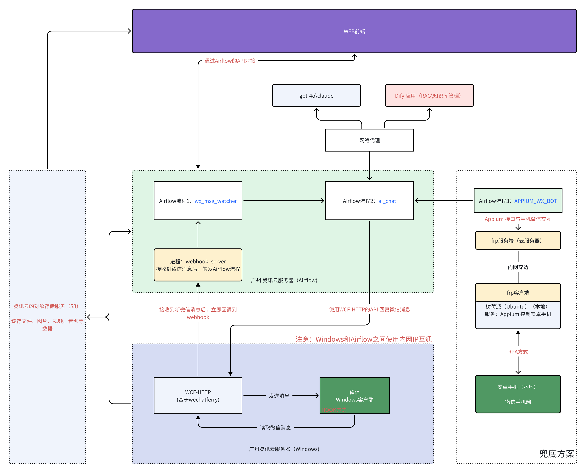

# wechat-on-airflow

## 项目简介

wechat-on-airflow 是一个基于 Apache Airflow 的项目，用于管理和编排 AI 驱动的微信聊天机器人工作流，实现自动回复消息、定时发送通知、自动更新菜单以及与微信 API 集成等自动化任务，提升微信机器人的响应效率和运营优化。

## 整体架构

## 关联项目

- [airflow](https://github.com/apache/airflow)
- [wcf-client-rust](https://github.com/lich0821/wcf-client-rust)

## 开发人员

